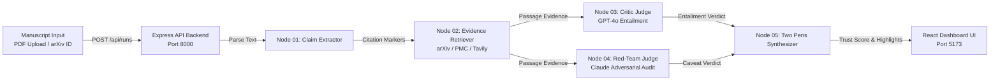

<div align="center">
  
  <h1>Citation Integrity Engine</h1>
  <p><b>Multi-Agent Adversarial Verification Platform for Academic Manuscripts &amp; Citation Entailment Audit</b></p>

  <p>
    <a href="https://github.com/KanishJebaMathewM/Citation-Integrity-Engine"></a>
    <a href="LICENSE"></a>
    <a href="server/index.js"></a>
    <a href="src/App.tsx"></a>
    <a href="#system-architecture"></a>
  </p>
</div>

---

## System Architecture



---

## Executive Summary

Existing citation tools verify whether a reference string exists in a database, but fail to answer the primary integrity question: **Does the cited source text actually support the claim made about it?**

The Citation Integrity Engine (CIE) addresses this gap by executing a multi-agent adversarial protocol. Rather than relying on single-model summarization, CIE deploys independent Critic and Red-Team reviewer agents that evaluate claim entailment without cross-agent communication. This architecture eliminates single-model bias, isolates subtle claim overreach, and generates itemized audit trails.

---

## Key Features & Capabilities

* **Adversarial Dual-Review Protocol**: Deploys independent Critic (GPT-4o) and Red-Team (Claude) evaluation agents operating in parallel without cross-visibility.
* **Two Pens Highlighter Methodology**: Computes visual stroke overlays on cited source passages. Single merged strokes denote consensus; offset dual strokes highlight reviewer disagreement.
* **Live Agent Trace Streaming**: Streams real-time state machine transitions and execution logs to an interactive terminal interface.
* **Transparent Token Cost Ledger**: Tracks exact prompt input/output token usage across every pipeline node with itemized USD cost accounting.
* **Dual Input Processing**: Accepts manuscript PDF file uploads or direct arXiv paper identifiers with automated passage extraction.
* **Dynamic Theme & Responsiveness**: Theme-aware design system supporting deep velvet violet light mode and royal violet dark mode.

---

## Two Pens Verification Methodology

The core visual signature of the Citation Integrity Engine is the Two Pens stroke resolution model:

* **Consensus (Entailed)**: When Critic and Red-Team agents agree that the cited passage fully supports the claim, a single green highlight stroke is drawn beneath the text passage.
* **Disagreement (Partial / Flagged)**: When the Red-Team agent identifies unstated caveats, scope limitations, or hyperparameter dependencies, two offset strokes (green for Critic, amber for Red-Team) are rendered beneath the target passage text.
* **Contradiction**: When the cited literature refutes or contradicts the claim, a red stroke indicator flags the item for manual author review.

---

## Multi-Agent Pipeline Specifications

The engine operates as a 5-node state machine:

1. **Node 01: Claim Extractor**: Parses manuscript text or uploaded PDF files to extract citation markers (e.g., [1], [2]) and isolate target claim statements.
2. **Node 02: Evidence Retriever**: Queries external APIs (arXiv HTTPS API, PubMed Central, Tavily search) to fetch authoritative source passage text for each citation marker.
3. **Node 03: Critic Judge (GPT-4o)**: Evaluates primary entailment between the manuscript claim and the retrieved passage text.
4. **Node 04: Red-Team Judge (Claude)**: Formulates adversarial counter-arguments to identify unstated assumptions, scope overreach, or missing conditions.
5. **Node 05: Two Pens Synthesizer**: Computes the final Trust Score (0-100%), resolves highlight stroke offsets, and outputs the itemized audit report.

---

## Installation & Local Setup

### Prerequisites

* Node.js v18.0 or higher
* npm v9.0 or higher
* Python 3.10 or higher (optional, for PDF generation utilities)

### 1. Repository Clone

```bash
git clone https://github.com/KanishJebaMathewM/Citation-Integrity-Engine.git
cd Citation-Integrity-Engine
```

### 2. Dependency Installation

```bash
npm install
```

### 3. Environment Configuration

Create a `.env` file in the root directory:

```env
OPENAI_API_KEY=your_openai_api_key_here
AGENT_ROUTER_API_KEY=your_agent_router_key_here
MODEL_PROVIDER=openai
BACKEND_PORT=8000
FRONTEND_PORT=5173
```

### 4. Running Locally

Launch the Express backend server and Vite frontend dev server in separate terminal windows:

```bash
# Terminal 1: Launch Express Node.js Backend (Port 8000)
npm run server

# Terminal 2: Launch Vite React Frontend (Port 5173)
npm run dev
```

Access the application in your browser at `http://localhost:5173`.

---

## REST API Specification

### 1. Create Verification Run

* **Endpoint**: `POST /api/runs`
* **Content-Type**: `multipart/form-data` or `application/json`
* **Parameters**:
  * `input_type`: `'arxiv_id'` or `'pdf'`
  * `arxiv_id`: (string, e.g. `'2005.14165'`)
  * `file`: (binary PDF upload)
* **Response**:

```json
{
  "run_id": "run-ejf14h75",
  "status": "queued"
}
```

### 2. Fetch Run Status

* **Endpoint**: `GET /api/runs/:run_id`
* **Response**:

```json
{
  "run_id": "run-ejf14h75",
  "status": "completed",
  "current_step": "completed",
  "claims_total": 3,
  "claims_processed": 3
}
```

### 3. Stream Live Agent Trace

* **Endpoint**: `GET /api/runs/:run_id/trace`
* **Response**:

```json
{
  "run_id": "run-ejf14h75",
  "events": [
    {
      "node": "claim_extractor",
      "summary": "Extracted 3 claims from manuscript.",
      "timestamp": "2026-08-15T14:55:20.124Z"
    },
    {
      "node": "critic_judge",
      "summary": "Critic agent evaluating entailment for Claim 1...",
      "timestamp": "2026-08-15T14:55:21.400Z"
    }
  ]
}
```

### 4. Fetch Final Trust Report

* **Endpoint**: `GET /api/reports/:run_id`
* **Response**:

```json
{
  "run_id": "run-ejf14h75",
  "paper_title": "Language Models are Few-Shot Learners",
  "trust_score": 90,
  "total_claims": 3,
  "resolved_count": 2,
  "flagged_count": 1,
  "unverifiable_count": 0,
  "total_cost_usd": 0.00084,
  "claim_results": []
}
```

---

## Evaluation Benchmark Papers

The engine includes pre-configured benchmark evaluation papers:

| arXiv Identifier | Paper Title | Evaluated Claims | Trust Score |
| :--- | :--- | :---: | :---: |
| **arXiv:1706.03762** | Attention Is All You Need (Vaswani et al.) | 4 Claims | **93%** |
| **arXiv:2005.14165** | Language Models are Few-Shot Learners (GPT-3) | 3 Claims | **90%** |
| **arXiv:2103.00020** | Learning Transferable Visual Models (CLIP) | 4 Claims | **92%** |
| **arXiv:1810.04805** | BERT: Pre-training of Deep Bidirectional Transformers | 3 Claims | **95%** |

To test PDF uploading locally, use the generated manuscript located at `examples/Quantum_Neural_Architectures_Sample_Paper.pdf`.

---

## Repository Directory Structure

```
Citation-Integrity-Engine/
├── docs/
│   ├── DEMO_SCRIPT.md           # Live demonstration script
│   ├── LIMITATIONS.md          # Known technical boundaries
│   └── SUBMISSION_SUMMARY.md   # Hackathon submission overview
├── examples/
│   ├── Quantum_Neural_Architectures_Sample_Paper.pdf
│   └── sample_run_output.json   # Full sample JSON audit export
├── public/
│   └── favicon.svg              # Brand logo icon
├── server/
│   ├── index.js                 # Express HTTP server & route handlers
│   └── pipeline.js              # Multi-agent state machine & LLM router
├── src/
│   ├── api/client.ts            # Frontend API client
│   ├── components/
│   │   ├── cie/                 # Design system & UI components
│   │   ├── AgentTraceViewer.tsx # Live terminal log viewer
│   │   └── AnimatedReveal.tsx   # Scroll reveal container
│   ├── lib/
│   │   ├── run-store.ts         # React state store
│   │   └── verdict.ts           # Score band & styling logic
│   ├── screens/                 # Dashboard, Upload, Progress, Report screens
│   ├── App.tsx                  # Main React SPA component
│   └── styles.css               # Design system token definitions
├── index.html
├── package.json
├── tailwind.config.js
└── vite.config.ts
```

---

## License

This project is licensed under the MIT License. See the [LICENSE](LICENSE) file for complete details.
